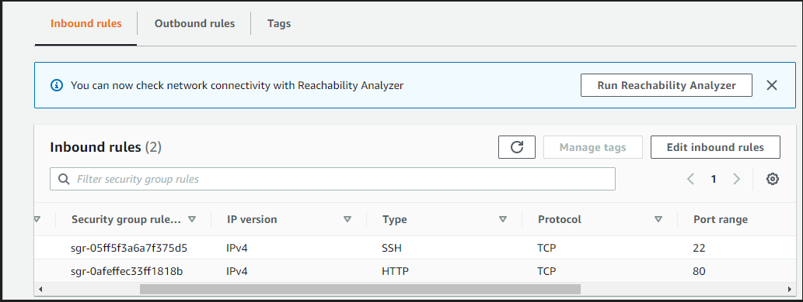
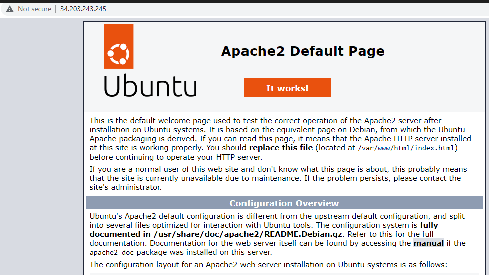
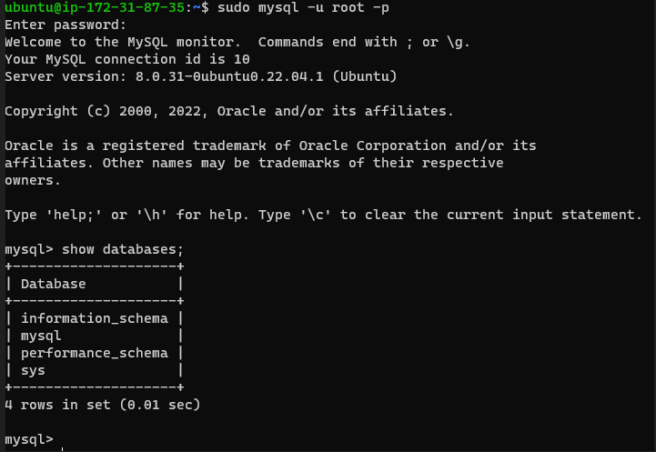
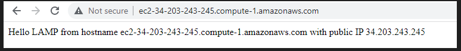
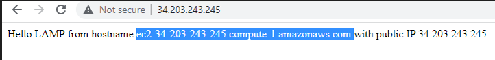
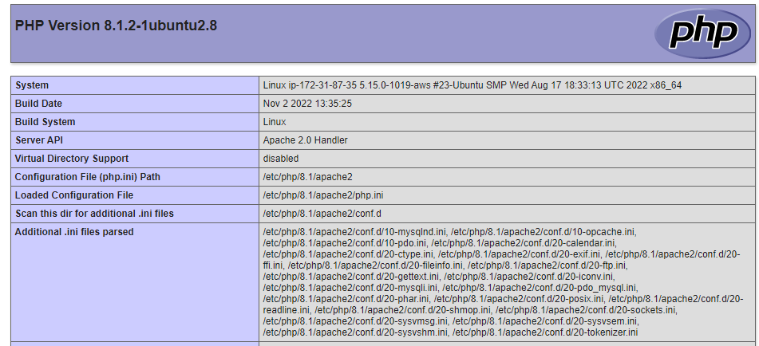

## Project 1 apache installation

`sudo apt update``sudo apt install apache2`
`sudo systemctl status apache2`

`ec2-security-group' 

`curl -s http://34.203.243.245/latest/meta-data/public-ipv4' 

`sudo apt install mysql-server' 

`Testing Virtual host using DNS' 

`Testing Virtual host using IP' 

`var/www/projectlamp/index.php' 
