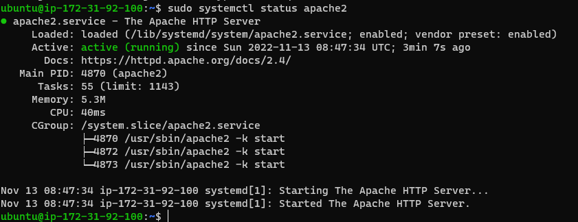

## Project 1 apache installation

`sudo apt update`
`sudo apt install apache2`
`sudo systemctl status apache2`

[markdown doc](https://www.markdownguide.org/cheat-sheet/)

[openssh](https://github.com/openssh)